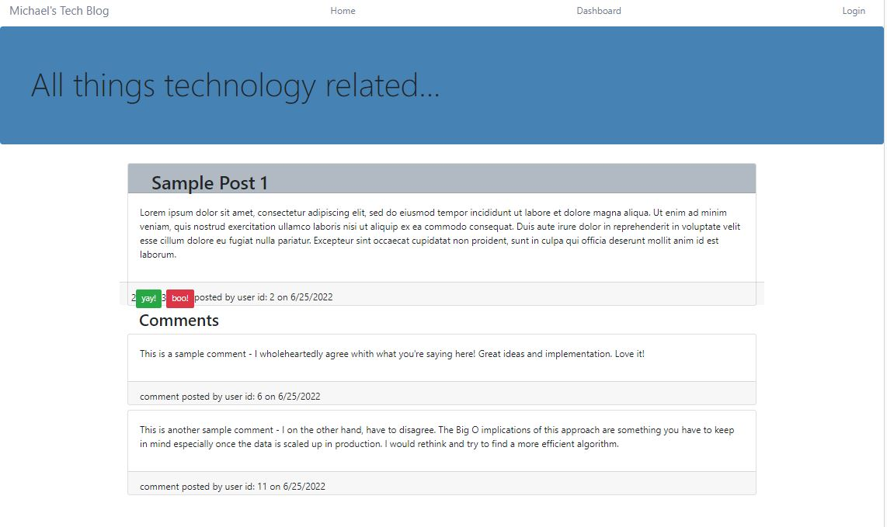

# Tech-Blog 

A remotely hosted full featured Blog application which focuses on Tech minded subjects.

# Description

The Tech Blog is a remotely deployed full stack application that makes use of many technologies to present the user with an intuitive experience, while keeping their personal data safe, and the blog data secure in a structured database. This application uses a deployed MySql database to store user and post data, and allows users to create new posts, edit posts, and upvote or downvote other's posts to show support or disapproval.

## Table of Contents

- [Screenshots](#screenshots)
- [Links](#links)
- [User Story](#user)
- [Technologies Used](#technologies)
- [Acceptance Criteria](#acceptance)
- [License](#license)

# Screenshots

# Links

The code repository is located on GitHub at [https://github.com/mdschenck/Tech-Blog](https://github.com/mdschenck/Tech-Blog)

The application is deployed on Heroku at [https://floating-escarpment-49352.herokuapp.com/](https://floating-escarpment-49352.herokuapp.com/)

# User

- AS A developer who writes about tech
- I WANT a CMS-style blog site
- SO THAT I can publish articles, blog posts, and my thoughts and opinions

# Technologies

- Node.js
- Express.js
- MySQL
- Handlebars
- Heroku

# Acceptance

The following acceptance criteria were met for this project:

GIVEN a CMS-style blog site

- [x] WHEN I visit the site for the first time
      THEN I am presented with the homepage, which includes existing blog posts if any have been posted; navigation links for the homepage and the dashboard; and the option to log in
- [x] WHEN I click on the homepage option
      THEN I am taken to the homepage
- [x] WHEN I click on any other links in the navigation
      THEN I am prompted to either sign up or sign in
- [x] WHEN I choose to sign up
      THEN I am prompted to create a username and password
- [x] WHEN I click on the sign-up button
      THEN my user credentials are saved and I am logged into the site
- [x] WHEN I revisit the site at a later time and choose to sign in
      THEN I am prompted to enter my username and password
- [x] WHEN I am signed in to the site
      THEN I see navigation links for the homepage, the dashboard, and the option to log out
- [x] WHEN I click on the homepage option in the navigation
      THEN I am taken to the homepage and presented with existing blog posts that include the post title and the date created
- [x] WHEN I click on an existing blog post
      THEN I am presented with the post title, contents, post creator’s username, and date created for that post and have the option to leave a comment
- [x] WHEN I enter a comment and click on the submit button while signed in
      THEN the comment is saved and the post is updated to display the comment, the comment creator’s username, and the date created
- [x] WHEN I click on the dashboard option in the navigation
      THEN I am taken to the dashboard and presented with any blog posts I have already created and the option to add a new blog post
- [x] WHEN I click on the button to add a new blog post
      THEN I am prompted to enter both a title and contents for my blog post
- [x] WHEN I click on the button to create a new blog post
      THEN the title and contents of my post are saved and I am taken back to an updated dashboard with my new blog post
- [x] WHEN I click on one of my existing posts in the dashboard
      THEN I am able to delete or update my post and taken back to an updated dashboard
- [x] WHEN I click on the logout option in the navigation
      THEN I am signed out of the site
- [x] WHEN I am idle on the site for more than a set time
      THEN I am able to view comments but I am prompted to log in again before I can add, update, or delete comments

# License

MIT License https://opensource.org/licenses/MIT
